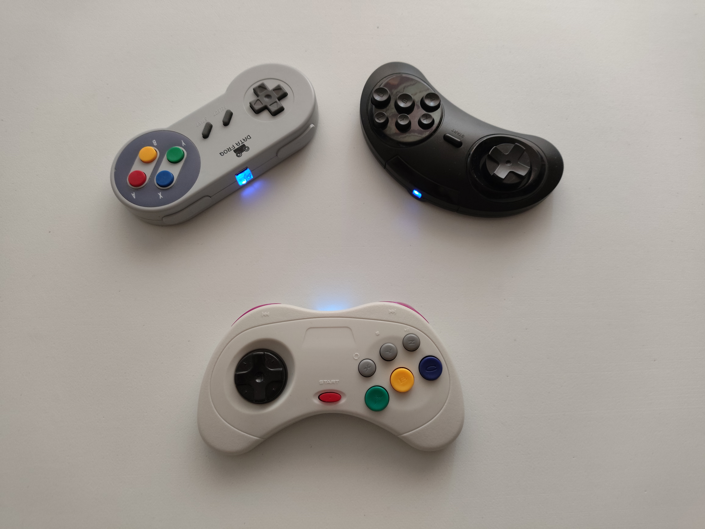
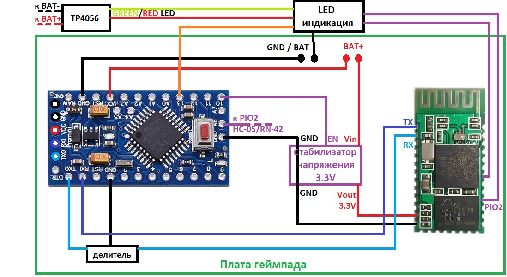
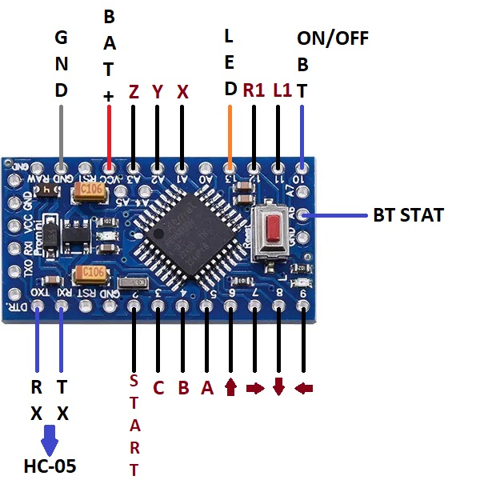
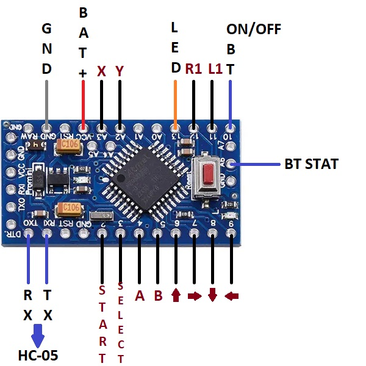

# Bluetooth Classic Gamepad на Arduino / LGT8F328P

Открытый геймпад с поддержкой **SEGA Genesis/Mega Drive 2**, **SEGA Saturn** и **SNES** исполнений, работающий через **Bluetooth HID** (модули HC-05 с прошивкой RN-42 или оригинальный RN-42) с управлением через Arduino/LGT8F328P. Питается от аккумулятора, имеет энергосберегающие режимы и защиту от разряда.  

В студенческие годы я накопил коллекцию недорогих проводных геймпадов в стиле старых консолей — но кабели мешали играть даже с USB-удлинителем 2 метра. Недавно решил дать им вторую жизнь: превратить в беспроводные через Bluetooth HID. Этот проект — результат сбора информации по крупицам, экспериментов с энергосбережением и постепенного наращивания функционала.

Теперь любой старый геймпад может стать автономным, энергоэффективным и совместимым с PC/Android через стандартный Bluetooth HID.

  
*Готовые переделанные геймпады **(SEGA MD2, SEGA Saturn и SNES исполнение)***  

## ✨ Особенности
- **Три режима исполнения**: SEGA (7-9 кнопок + D-Pad) / SNES (8 кнопок + D-Pad)
- **Энергосбережение**:
  - Рабочий режим: 25–35 мА
  - Поиск соединения: 18–40 мА
  - Глубокий сон: Arduino > 10 мкА, LGT8F328P ~100 мкА
- **Умное управление питанием**:
  - Контроль напряжения каждые 10 сек
  - Световая индикация при разряде ниже 3.3В
  - Индикация с блокировкой использования при напряжении батареи ниже 3.1В
  - Автоотключение при отсутствии сопряжения >2 мин (BT-модуль в режиме поиска)
  - Автоотключение при простое >5 мин (не нажималась ни одна кнопка)
  - Комбинация для принудительного сна (удержание 3 сек): **↓ + X + B + Z** (SEGA) / **↓ + Y + B + A** (SNES)
- **Управление Bluetooth**:
  - Проверка статуса подключения каждые 10 сек
  - Полное отключение BT-модуля путём отключения преобразователя напряжения
- **Надёжность**:
  - Watchdog против зависаний
  - Защита от зависаний BT-модуля переводом геймпада в сон

## 📁 Структура проекта
```
REPO
├── HC-05_BT-HID_retro_gamepad/		# Скетч Arduino
├── docs/							# Изображения и доп. инструкции
├── .gitignore
├── LICENSE
└── README.MD
```

## 🧩 Необходимые компоненты
- **Геймпад**: геймпад для модификации
- **Микроконтроллер**: Arduino Pro Mini (желательно 3.3 В / 8 МГц) **или** LGT8F328P Pro Mini
- **BT-модуль**: HC-05 / HC-06 (с прошивкой RN-42) **или** оригинальный RN-42
- **Модуль заряда аккумулятора**: например, TP4056 Type-C
- **Аккумулятор**: Li-Ion/Li-Po 3.7 Вольт, ≥400 мА·ч
- Резисторы, светодиоды и провода

## ⚙️ Иные требования
- **IDE**: Arduino IDE
- **Библиотеки**:
  - [GyverLibs/TimerMs](https://github.com/GyverLibs/TimerMs)
  - [GyverLibs/Blinker](https://github.com/GyverLibs/GyverBlinker)
  - Для Arduino: [iarduino_VCC](https://github.com/tremaru/iarduino_VCC)
  - Для Arduino желательно (**обязательно для ATmega328PB**): [MiniCore](https://github.com/mcudude/minicore) (GPLv2)
  - Для LGT8F328P: [LGT8Fx Boards](https://github.com/dbuezas/lgt8fx)

## 🛠 Сборка скетча
1. Установите зависимости через Library Manager
2. Выберите схему подключения кнопок в скетче:
   ```cpp
   #define SEGA_JOY   // или
   //#define SNES_JOY
   ```
3. Выберите в скетче будет ли считываться через отдельный pin состояние собряжения BT-модуля:
   ```cpp
   //#define BT_STATUS_ENABLED
   ```
4. Загрузите скетч через Arduino IDE

> ***Проект протестирован на Android с поддержкой Bluetooth HID (эмуляторы).***

## 🔌 Подключение
- **TX/RX**: Arduino <--> BT-модуль (логика 3.3 Вольта! ЖЕЛАТЕЛЬНО установить резисторный делитель)
- **BTSTAT_PIN**: Arduino <--> GPIO-2 BT-модуля (HIGH = подключено, LOW = нет соединения)
- **PWRLED_PIN**: мигает при низком напряжении (<3.3 В)
    
*Схема подключения модулей*  

- **Схема подключения кнопок**. *Все кнопки срабатывают на логический нуль (LOW)*
> ⚠️ Пины D6/D7 на ATmega328P/PA склонны к ложным срабатываниям — рекомендуется переназначить на аналоговые входы (A4/A5). Либо можете попробовать с предложенными исправлениями, которые в теории решают проблему, но у меня не осталось микроконтреллеров старой серии, чтобы проверить.  

    
*Схема подключения кнопок к Arduino **(SEGA исполнение)***  
  
  
*Схема подключения кнопок к Arduino **(SNES исполнение)***  


## 🔄 Изменения
### v1.1.0
- Доработка режимов сна
- Уменьшение времени сработки некоторых таймеров
- Отказ от программного управления BT-модулем
- Пересмотр логики работы таймеров и комбинаций
- Фикс измерения напряжения LGT8F328P
- Программная попытка решить проблему D6/D7 на старых ATmega  

### v1.0.0
- Первый релиз  
- Поддержка SEGA/SNES, Bluetooth HID, энергосбережение, программное управление BT-модулем  

## 📄 Лицензия
- **Код** распространяется под лицензией [**GNU GPL v3+**](LICENSE).  
  (для обеспечения открытости образовательного контента; предназначен исключительно для демонстрации навыков работы с embedded-системами, энергосбережением и Bluetooth HID).

- **Схемы и документация** — свободны для **некоммерческого использования** при обязательном указании источника.